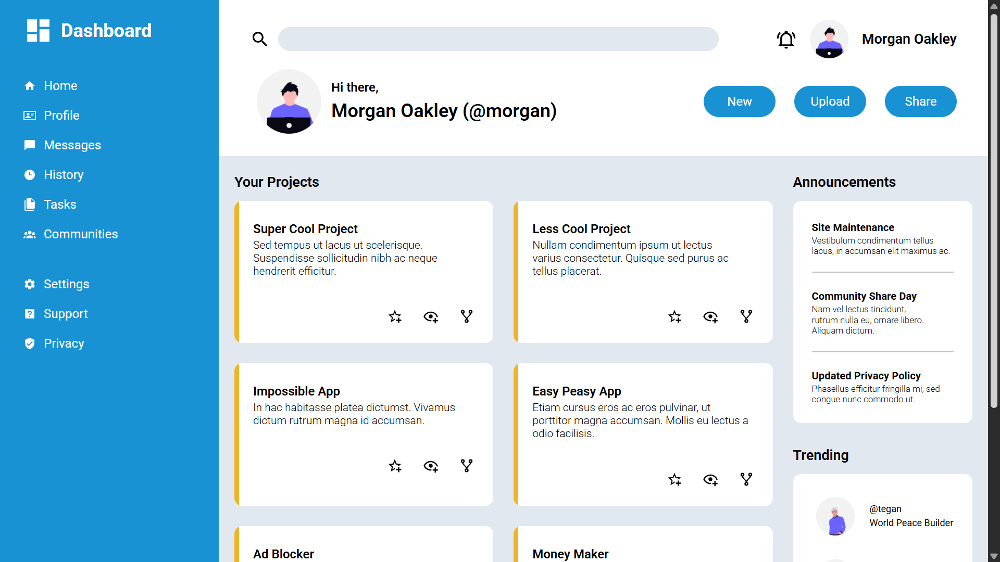

# Admin Dashboard

A responsive admin dashboard built as part of The Odin Project curriculum. This project focuses on layout structuring using HTML and CSS, with additional JavaScript functionality implemented to improve usability on mobile devices.

## Live Demo

[GitHub Pages](https://dhee-codes.github.io/admin-dashboard/)

## Screenshot

## Overview

This project demonstrates the creation of a modern admin dashboard interface. The primary goal was to practice layout techniques such as CSS Grid and Flexbox while maintaining a clean and structured UI.

To enhance the base requirements, JavaScript was added to handle mobile responsiveness by implementing a sidebar toggle feature.

## Features

- Structured dashboard layout using HTML and CSS
- Sidebar navigation
- Responsive design principles
- Mobile-friendly sidebar toggle (JavaScript)
- Clean and minimal UI design

## Technologies Used

- HTML5
- CSS3 (Grid & Flexbox)
- JavaScript (for interactivity)

## Acknowledgment

This project was completed as part of The Odin Project curriculum.